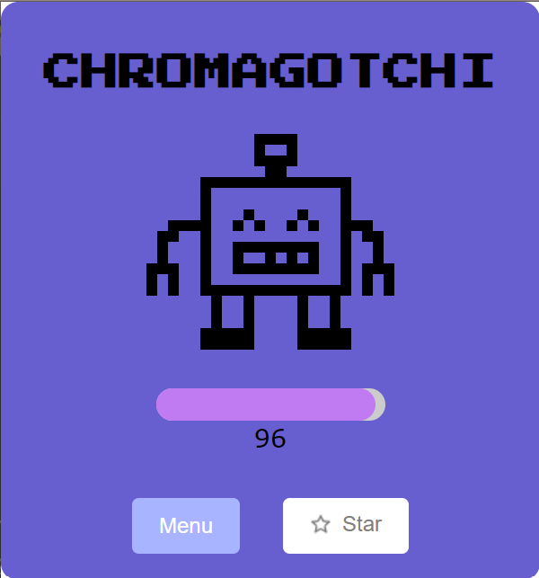
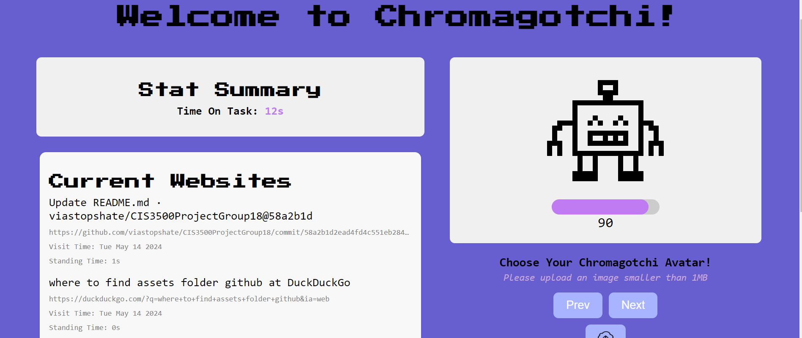

# Chromagotchi

## Table of Contents

- [Chromagotchi](#chromagotchi)
  - [Table of Contents](#table-of-contents)
  - [Landing Page](#landing-page)
  - [Features](#features)
  - [Installation](#installation)
  - [Usage](#usage)
    - [Popup](#popup)
    - [Landing Page](#landing-page)
    - [Health System](#health-system)
  - [Configuration](#configuration)
  - [Technical Overview](#technical-overview)
  - [Contributing](#contributing)
  - [Contact](#contact)

## Landing Page

To see our landing page for this project, click [here!](https://claraxfee.github.io/chromagotchi-landing-page/)

This landing page includes a couple blog posts about our development journey for Chromagotchi. You can also access our demo video, which walks through the features and usage of Chromagotchi! Scroll down to the "Featured Pages" section of the above landind page to view these items, or click [here](https://youtu.be/_3sgMnn1zTU) to view our demo video directly!

## Features

- Automatic website usage tracking
- Health system that changes based on tabs opened and time spent on starred tabs
- "Star" functionality to mark important tabs and boost your Chromagotchi's health
- Personalized design with a choice of 5 cute avatars or the option to upload your own image
- Easy to use and enjoyable user experience

## Installation

### Install From Release

- Download the latest release (download-me.zip) from the [Releases](https://github.com/viastopshate/CIS3500ProjectGroup18/releases/tag/Latest)
- Unzip the downloaded ZIP file
- Open Chrome and navigate to `chrome://extensions`
- Enable "Developer mode"
- Drag and drop the unzipped folder into the extensions page

### Install From Source

1. Clone the repository:

   ```bash
   git clone https://github.com/viastopshate/CIS3500ProjectGroup18
   ```

2. Install dependencies:

   ```bash
   cd CIS3500ProjectGroup18
   npm install
   ```

3. Build the extension:

   ```bash
   npm run build
   ```

4. Load the extension in Chrome:

   - Open Chrome and navigate to `chrome://extensions`
   - Enable "Developer mode"
   - Click "Load unpacked" and select the `dist` directory from the project

## Usage

### Popup

- The popup displays your Chromagotchi and its current health status, which is influenced by your browsing behavior.
- Use the "Star" button to star important websites. Spending time on starred websites will increase your Chromagotchi's health, while non-starred websites will decrease it.
- Screenshot of Pop-up:


### Landing Page

- The landing page provides an overview of your website usage statistics and allows you to customize your Chromagotchi.
- Keep in mind that opening new tabs that are not starred will decrease your Chromagotchi's health, encouraging you to manage your tabs effectively. On the other hand, using tabs that are starred will boost health, incentivizing users to stay on task. 
- - Screenshot of Landing Page:


### Health System

Chromagotchi incorporates a health system that reflects your browsing behavior and encourages productive habits. Spending time on starred websites increases health score, while viewing non-starred websites decreases health. Similalry, opening a new tab decreases your Chromagotchi's health score.

## Configuration

Chromagotchi provides a few configuration options to customize your experience. We allow users to choose from a set of pre-designed avatars or upload your own image (less than 1MB) to personalize your Chromagotchi. Configuration options can be accessed through the landing page of the extension.

## Technical Overview

Chromagotchi is built using React, a popular JavaScript library for building user interfaces. The project structure is organized as follows:

- `public` folder:

 - Contains configuration files for the Chrome extension.
 - `background.js`: Implements the background script for the extension, handling tab events and communication with the content script.
 - `index.html`: The main HTML file for the extension's landing page.
 - `popup.html`: Serves as the entry point for the extension's popup, providing a portal to display the popup content.
 - `manifest.json`: Defines the extension's metadata, permissions, and other configuration details.

- `src` folder:
  - Contains the source code for the extension's components and functionality.
  - `popup` folder:
    - Implements the extension's popup component.
    - Includes JSX files for the popup's structure and logic.
    - Uses CSS files for styling the popup.
  - `landing-page` folder:
    - Implements the extension's landing page component.
    - Includes JSX files for the landing page's structure and logic.
    - Uses CSS files for styling the landing page.
    - `utils.js`: Contains utility functions, including the implementation of the health system.
    - `WebsiteList.js`: Handles time tracking functionality and displays the list of websites visited by the user.

## Contributing

Clara Fee, John Otto, Laya Yalamanchili, Via Liu

## Contact

For any questions, feedback, or inquiries, please feel free to reach out:

- Name: Via Liu
- Email: bangchel@sas.upenn.edu

We appreciate your interest in Chromagotchi and look forward to hearing from you!

## Licensing 

Copyright (c) 2024 Clara Fee, Via Liu, John Otto, Laya Yalamanchili. All rights reserved.

Permission is hereby granted, free of charge, to any person obtaining a copy of this software and associated documentation files (the "Software"), to use the Software for non-commercial purposes only. This includes the rights to use, copy, and distribute the Software in its original form.

The following restrictions apply:
1. The Software may not be modified, remixed, or adapted in any form.
2. The Software may not be used for commercial purposes without express written permission from [Your Name or Company Name].
3. Redistributions of the Software must retain the above copyright notice, this list of conditions, and the following disclaimer.

 Clara Fee, Via Liu, John Otto, and Laya Yalamanchili reserve the right to modify or update this license at any time without prior notice. By using the Software, you agree to be bound by the terms of the license in effect at the time of use.

THE SOFTWARE IS PROVIDED "AS IS", WITHOUT WARRANTY OF ANY KIND, EXPRESS OR IMPLIED, INCLUDING BUT NOT LIMITED TO THE WARRANTIES OF MERCHANTABILITY, FITNESS FOR A PARTICULAR PURPOSE AND NONINFRINGEMENT. IN NO EVENT SHALL THE AUTHORS OR COPYRIGHT HOLDERS BE LIABLE FOR ANY CLAIM, DAMAGES OR OTHER LIABILITY, WHETHER IN AN ACTION OF CONTRACT, TORT OR OTHERWISE, ARISING FROM, OUT OF OR IN CONNECTION WITH THE SOFTWARE OR THE USE OR OTHER DEALINGS IN THE SOFTWARE.
